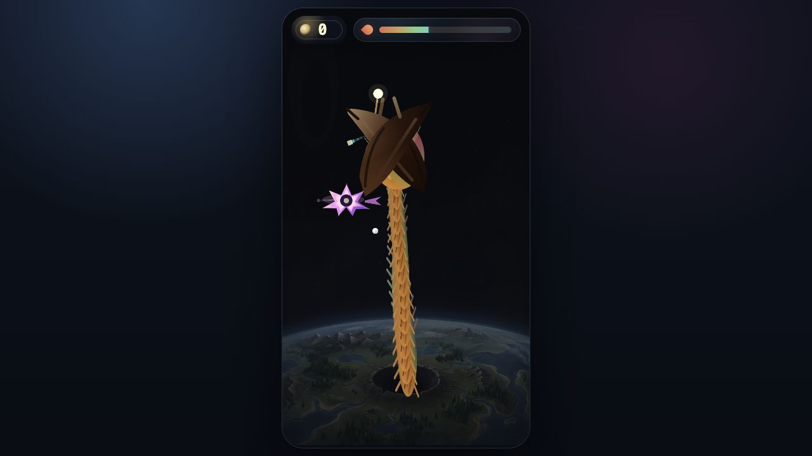

# Space Worm

**Space Worm** is a fully AI-generated cinematic arcade game about an enormous
cosmic predator rising from a living planet to devour ships crossing low orbit.

It is built around a single violent action: click or tap a ship, and the worm
launches from the planet surface toward its prey. Hits restore satiety and keep
the run alive. Misses cost precious hunger time. The result is a compact,
dramatic score-chasing loop with neon ships, pixel comets, orbital motion,
engine audio, and a planet-sized monster.



## Gameplay

Space Worm is intentionally simple to play and immediate to read:

- Ships fly through orbital lanes with different silhouettes, speeds, values,
  and movement patterns.
- The worm waits on the planet surface.
- The player clicks or taps a ship to launch a strike.
- A successful bite adds score and restores satiety.
- A miss drains satiety and forces a short recovery.
- The run ends when satiety reaches zero.

The challenge comes from timing and target choice. Faster ships are worth more,
but a bad strike can end a run quickly.

## Controls

| Action      | Input                        |
| ----------- | ---------------------------- |
| Start run   | Click/tap the start button   |
| Attack ship | Click/tap a ship             |
| Restart run | Click/tap the restart button |

## Features

- One-button arcade combat loop.
- Satiety pressure instead of a health bar.
- Multiple ship archetypes with unique movement profiles.
- Animated worm strike, bite, retract, and recovery phases.
- Parallax space backdrop with an orbital moon and ambient pixel comets.
- Ship trails, glow effects, bite feedback, and cinematic start/restart
  overlays.
- Spatial-style ship engine audio and bite/UI sound effects.
- A small TypeScript simulation layer separated from Phaser rendering.

## Tech Stack

- [Phaser 3](https://phaser.io/) for scenes, rendering, game objects, input,
  and audio.
- [TypeScript](https://www.typescriptlang.org/) for simulation and view logic.
- [Vite](https://vite.dev/) for local development and production builds.
- Plain DOM and CSS for the HUD, intro, and restart overlay.

## Run Locally

Requirements:

- Node.js 20+ recommended.
- pnpm.

Install dependencies:

```bash
pnpm install
```

Start the development server:

```bash
pnpm dev
```

Build the production bundle:

```bash
pnpm build
```

Preview the production bundle:

```bash
pnpm preview
```

Run project checks:

```bash
pnpm verify
```

Note: in local development, `pnpm verify` can fail if unrelated generated build
artifacts are present under auxiliary worktree folders. The production game
build itself is verified with `pnpm build`.

## Deployment

The project is configured for GitHub Pages through GitHub Actions.

- Pages URL: <https://ilyamirin.github.io/space-worm/>
- Workflow: [`.github/workflows/deploy-pages.yml`](.github/workflows/deploy-pages.yml)
- Publishing source: GitHub Actions

The workflow installs dependencies with pnpm, typechecks the project, builds the
Vite static bundle with `GITHUB_PAGES=true`, uploads `dist/` as a Pages artifact,
and deploys it with `actions/deploy-pages`.

## Project Structure

```text
src/game/               Simulation state, content, assets, and shared types
src/phaser/             Phaser scenes, rendering views, and scene bridge
src/ui/                 DOM HUD and overlay creation
src/styles.css          App shell, HUD, intro, and restart styling
public/assets/          Runtime image, audio, and data assets
docs/                   Design notes and README screenshot
```

## Architecture Notes

The game is split into a small simulation core and Phaser-specific rendering:

- `GameSimulation` owns score, satiety, ship spawning, strike state, hit/miss
  handling, and difficulty progression.
- `GameplayScene` bridges simulation state into Phaser objects.
- View classes such as `WormView` and `ParallaxField` render the worm, ships,
  background layers, comets, glow, and motion feedback.
- The DOM HUD subscribes to the scene bridge and dispatches start/restart
  actions.

This keeps the game loop compact while still allowing the visuals to be layered
and theatrical.

## AI Generation Disclosure

This project is intentionally fully AI-generated, except for the credited CC0
third-party audio assets.

AI assistance was used for the game concept, implementation, TypeScript
architecture, CSS, SVG game objects, generated visual art direction, UI
composition, documentation, and gameplay screenshot capture. Human direction was
used to guide the concept, request changes, choose the tone, approve assets, and
shape the final result.

Third-party audio assets are not claimed as AI-generated. They are credited
below and remain under their original free licenses.

## Assets And Credits

Original project assets:

- Worm, ships, UI composition, generated environment imagery, intro artwork,
  gameplay visuals, code, and documentation: AI-generated for this project.

Free third-party audio assets:

- Music: **"Out There"** by **yd**, licensed **CC0 1.0**.
  Source: <https://opengameart.org/content/space-music-out-there>
- Sound effects and ship engine sounds from **Kenney Sci-Fi Sounds**, licensed
  **CC0 1.0**.
  Source: <https://kenney.nl/assets/sci-fi-sounds>
- Interface sounds from **Kenney Interface Sounds**, licensed **CC0 1.0**.
  Source: <https://kenney.nl/assets/interface-sounds>

The machine-readable audio credit list lives in
[`public/assets/data/audioCredits.json`](public/assets/data/audioCredits.json).

## License

The project code and original project assets are released under the MIT License.
See [LICENSE](LICENSE).

Third-party audio remains under its original CC0 1.0 terms as credited above.
